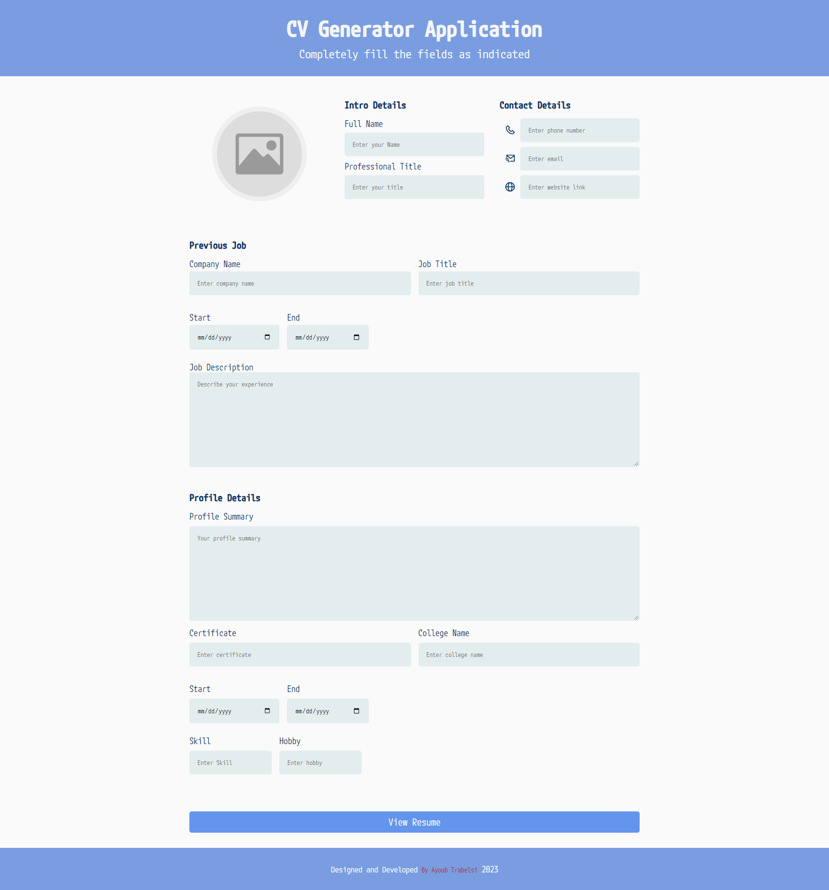

<div align="center">
  
  
  
  <br />
  <br />

  <h2 align="center">CV Generator Application</h2>

  CV Generator , <br />Responsive for all devices, build using HTML, CSS, and JavaScript.

</div>

<br />

### Demo Screeshots



### Prerequisites

Before you begin, ensure you have met the following requirements:

* [Git](https://git-scm.com/downloads "Download Git") must be installed on your operating system.

### Run Locally

To run **Taskbuddy** locally, run this command on your git bash:

Linux and macOS:

```bash
sudo git clone https://github.com/devpayoub/CV-Generator-Application.git
```

Windows:

```bash
git clone https://github.com/devpayoub/CV-Generator-Application.git
```

### Contact

If you want to contact with me you can reach me at [Facebook](https://www.facebook.com/EminemTB).

## Credits :
```
This Script is free to distribute, modify and use with the condition that credit is provided to the creator (@devpayoub) and is not for commercial use.
Email : trabelsi.ayoub1998@gmail.com
```
